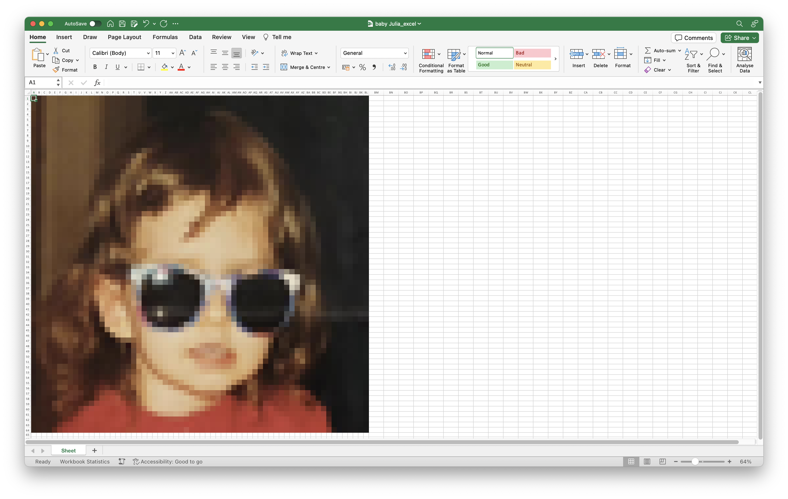

# Photo-to-Excel
This code allows you to convert your photo to excel format. 

## The Photo-to-Excel converter works in the following way:
1. The photo you specify is first pixelated into 64x64 pixel format, 
2. Colours are extracted from each of the pixels,
3. Excel workbook is created, and the extracted colours are used to colour a grid of 64x64 cells in excel. 

  

## Instructions:
The default photo used is the one provided in the 'example' folder, which incidentally, is a photo of me as a child. If you want to convert a different photo, just change the *'img_path'* variable in the photo_to_excel.py file. 

## The purpose of the project:
You might ask 'why would I convert my photos to Excel?'. My response is: 'why not?'.
